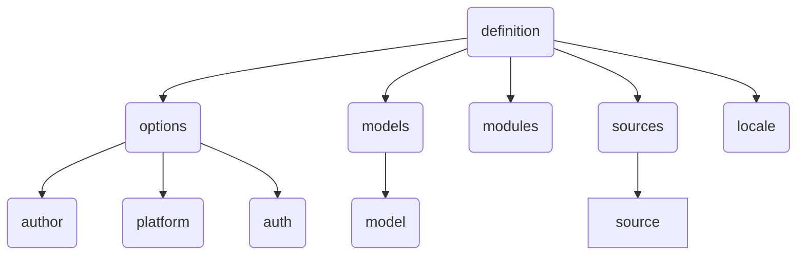

# Garfield definition

## Diagram




## Structure

```json
{
    "options": {
        "name": "", 
        "pathToProject": "", 
        "project": "", 
        "logo": "", 
        "description": "", 
        "theme": "", 
        "author": {
            "name": "",
            "email": ""
        }, 
        "date": "", 
        "version": "", 
        "platform": {
            "type": "",
            "host": ""
        }, 
        "connection": "", 
        "auth": {
            "strategy": "",
            "model": "",
            "secretKey": "",
            "roleType": "",
            "roles": {
                "rol": {
                    "model": { 
                        "read": "sibling", 
                        "create": "sibling", 
                        "destroy": "sibling", 
                        "update": "sibling" 
                    },                   
                },
                "any": {}
            }
        }, 
        "modelReference": "", 
        "allowDefaultRegister": False
    }, 
    "models": {
        "model": {
            "actions": [],
            "events": {},
            "fields": {
                "defaultValue": "",
                "faker": "",
                "multiLine": "",
                "onFilter": "bool",
                "printAs": {},
                "rowsMax": "int",
                "show": "bool",
                "type": "str",
                "validationErrors": [],
                "validations": [],
                "values": []
            },
            "icon": "",
            "layout": [],
            "plugins": {},
            "printAs": {},
            "printers": {},
            "queries": {},
            "relations": {
                "belongsTo": "",
    			"belongsToMany": [],
                "category": [],
                "hasMany": [],
                "hasOne": [],
                "required": [],
                "selfReferenced": "",
                "useMany": []          
            },
            "show": "bool",
            "source": {},
            "view": {}
        }, 
    }, 
    "modules": {
        "server": [
            {
                "name": "",
                "path": ""
            }
        ]
    }, 
    "sources": {
        "source": {
            "type": "",
            "path": ""
        }
    }, 
    "locale": {
        "word": "translation"
    }
}
```

